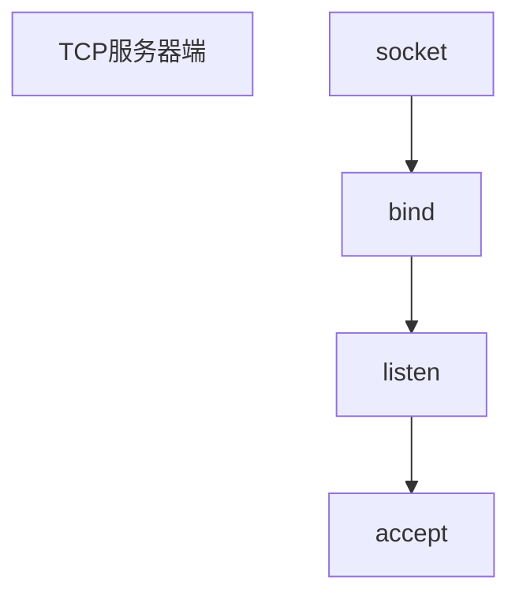

tcp,http

```
Q:什么叫socket，为什么会有listen，bind等几个步骤？
```

```
https://www.cnblogs.com/baxianhua/p/9285102.html
A:网络上的两个程序通过一个双向的通信连接实现数据的交换，这个连接的一端称为一个socket

建立网络通信连接至少要一对端口号（socket），socket本质是编程接口（API），对TCP/IP的封装，TCP/IP也要提供可供程序员做网络开发所用的接口，这就是Socket编程接口。
HTTP是轿车，提供了封装或者显示数据的具体形式。
Socket是发动机，提供了网络通信的能力。


Socket的英文“孔”或“插座”，通常也称作“套接字”，用于描述ip地址和端口，是一个通信链的句柄，可以用来实现不同虚拟机或不同计算机之间的通信。

Socket正如其英文原意那样，像一个多孔插座，一台主机犹如布满各种插座的房间。插座可以提供不同的服务
```




